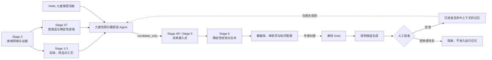

# 九类性质归属核验 Agent 与受控自进化方案及小样本结果

日期：2026-08-24  
代码分支：`feature/specialized-attribution-evolution-20260824`  
试验性质：工程可行性试验，不是可外推的论文性能评估

## 1. 结论

本次已经完成两个可独立运行的原型：

1. **九类性质归属核验 Agent**：读取现有 Stage 0、Stage 3 和 Stage 4T 产物，核验复杂表头属于哪一类 PoLyInfo specialized 字段，并判断表中样品标签能否绑定到 Stage 3 样品。Agent 不读取或改写性质数值，输出恒为 `candidate_only`。
2. **受控自进化闭环**：从 development gold 中提出规则候选，经人工批准后编译成版本化记忆；只把与当前表头匹配的记忆提供给 Agent，再在冻结测试集上执行不退化门禁。系统不会自动改写生产词表、Schema、`candidate.json` 或 `final.json`。

5 篇小试验中，基线 Agent 对预标注的 10 个语义锚点全部识别正确，样品绑定为 16/25。主要短板不是九类性质语义，而是复杂分组表中的样品归属。第一次“把全部记忆提供给全部表格”的自进化使冻结集样品绑定从 90.91% 降至 81.82%，被门禁正确拦截。改为**按表头检索记忆并复用无关表的冻结基线**后，四项门禁全部通过，冻结集语义 F1 保持 100%，样品绑定保持 90.91%。由于冻结集只有 3 张表且基线语义已经达到上限，本轮没有证明性能提升，只证明了受控更新可以避免已观察到的回归。

## 2. 与未来整体架构的关系

主架构仍是确定性工作流，Agent 是高风险节点的专业核验器，不新增生产 Stage：



当前实现停在图中的 `candidate_only` 输出。它已经能独立运行和评估，但尚未自动写入 Stage 4R、Stage 5 或最终数据库。这符合“宽候选、窄发布”和 Stage 6 保持确定性的边界。

## 3. Agent 核验的九类内容

受控词表已加入 `extraction/config/polymer_schema.yaml`：

| PoLyInfo specialized 字段 | 当前受控语义示例 |
|---|---|
| `average_molecular_weight` | `molecular_weight`，保留 Mn、Mw、Mv、Mz 等 variant |
| `solution_viscosity` | `solution_viscosity`，区分 inherent、intrinsic、reduced、specific |
| `crystallinity` | 结晶度及其报告形式 |
| `degree_of_polymerization` | 聚合度 |
| `crystallographic_data` | `d_spacing`、`two_theta` |
| `primary_structure_informations` | 一次结构描述 |
| `morphology` | 纤维长度、孔结构等受控形貌语义 |
| `stereoregularity` | 立构规整性描述 |
| `characteristics_of_material` | 材料特征枚举或描述 |

这套词表是业务控制面。Pydantic 只约束 Agent 的输出结构，运行时校验 `source_field + semantic_label + variant` 是否属于受控词表。

## 4. Agent 怎样工作

### 4.1 输入工具

Agent 每次只处理一张高风险表，并调用固定的本地读取工具：

1. 读取 Stage 0 的表格网格、caption、cell ID 和邻近证据；
2. 查询 Stage 3 的 `sample_id`、原始标签、实体、材料类型和状态；
3. 查询九类受控词表；
4. 读取 Stage 4T 当前候选及阻断原因；
5. 检索与当前 caption 或表头明确匹配的已批准记忆。

### 4.2 输出边界

Agent 只输出两类判断：

- `semantic_assignments`：表头是九类性质、非九类性质还是未知；
- `sample_assignments`：样品标签是唯一匹配、歧义、未匹配还是隐含主体。

所有数据单元格在发给模型前会替换为 `<NUMERIC>` 等占位符。输出 Schema 不含 `value_raw`、`value_min` 或 `value_max`，因此数值仍只能由代码从 Stage 0 cell 确定性读取。

### 4.3 可信控制

模型返回后由代码检查：

- 引用的 `cell_id` 是否真实存在；
- `sample_id` 和 `entity_id` 是否来自 Stage 3 且一致；
- 九类字段、语义和 variant 是否在 YAML 允许范围；
- 非 specialized 判断是否错误携带九类字段；
- 输出结构是否包含未声明字段。

首次输出不合法时最多允许一次修复。修复仍不通过则输出 fallback 候选，不静默发布。

## 5. 自进化怎样工作

自进化不是让模型自行修改提示词，而是以下受控循环：

```text
冻结当前版本
-> 在 development gold 上定位可复现错误
-> 生成最小规则候选
-> 人工审核批准、拒绝或待定
-> 编译版本化记忆
-> 仅按 caption/表头检索适用记忆
-> 在冻结测试集比较基线与进化版
-> 通过全部门禁后才进入领域专家复核
```

本轮记忆只有解释指导，不含性质值、样品答案或冻结测试集答案。批准的 4 条模式为：

1. XRD 多层表头中 `2 theta` 与 Miller 指数的角色区分；
2. `d-spacing`、`interlayer distance` 等到 `crystallographic_data/d_spacing` 的映射；
3. Mn、Mw、Mv、Mz 与分子量分布的语义区分；
4. inherent、intrinsic、reduced、specific viscosity 的 variant 区分。

`Calcd/Found` 分组表中的跨列样品标签规则虽然对应一个真实漏绑问题，但只有一篇 development 论文支持，因此被标为 `pending`，没有进入已批准记忆。

门禁包括：

- 冻结集语义 F1 不下降；
- 冻结集样品绑定不下降；
- Agent 运行失败数不增加；
- 九类范围外负对照不产生 specialized 假阳性。

## 6. 五篇小试验

所有试验复用 `batch_results/demo5_stage5_sharded_review_20260823` 中已有 Stage 0-5 产物，没有重新调用 MinerU。

| 分组 | 文献 | 表格 | 主要核验内容 |
|---|---|---|---|
| development | `reference_no_0020284`，*Synthesis and Characterization of Aromatic and Brominated Aromatic Polycarbonates...* | `T_5_70` | XRD 的 2 theta、d-spacing、结晶度及 PC-1 至 PC-6 |
| development | `reference_no_0038813`，*Preparation and characterization of thermally stable poly(amide-urea)s...* | `T_5_78` | inherent viscosity、Mn、Mw、Mw/Mn 与 8 个分组样品 |
| frozen test | `reference_no_0038527`，*Synthesis, Properties, and Tunable Supramolecular Architecture...* | `T_5_69` | interlayer distance、2 theta 与 6 个聚噻吩样品 |
| frozen test | `reference_no_0043590`，*Multiple Percolation in a Carbon-Filled Polymer Composites via Foaming* | `T_4_63` | 平均纤维长度和复合材料样品状态 |
| frozen test | `reference_no_0043541`，*Structure and Surface Properties of High-density Polyelectrolyte Brushes...* | `T_4_49` | 接触角、表面自由能等九类范围外负对照 |

Gold 是本轮为工程验证建立的技术核验集，尚未经过独立高分子专家双人标注。因此结果只能说明代码链路和风险控制可用。

## 7. 试验结果

### 7.1 五篇基线

| 指标 | 结果 |
|---|---:|
| Agent 成功运行 | 5/5 |
| 预标注九类语义锚点 | 10 |
| 语义 Precision / Recall / F1 | 100% / 100% / 100% |
| 样品绑定 | 16/25，64.0% |
| API 调用 | 9 次，含修复调用 |
| 模型报告费用 | 2.000903 元 |

语义结果很好，但样品绑定暴露了真正难点：`reference_no_0038813` 的表头先跨列给出 8 个聚合物名，随后用 `Calcd/Found` 表示计算值和实测值。Agent 正确识别了 4 类性质，却没有输出 8 个样品绑定，导致 development 集样品绑定仅为 6/14。该问题不能靠扩大性质词表解决，需要专门的分组表关系解析。

`reference_no_0043590` 中 `cCF10` 可对应某个 Stage 3 样品，但 Stage 3 尚未完整表达发泡前后状态。Gold 因此保守要求 unresolved；Agent 给出具体样品，属于需要全文或状态图复核的风险，不应直接发布。

### 7.2 自进化对照

| 版本 | 冻结集语义 F1 | 冻结集样品绑定 | 门禁 | 说明 |
|---|---:|---:|---|---|
| 冻结基线 | 100% | 90.91% | 基准 | 3 张冻结表 |
| 全量记忆直接注入 | 100% | 81.82% | **未通过** | 无关规则改变了负对照的样品判断 |
| 上下文检索记忆 | 100% | 90.91% | **全部通过** | 只对 XRD 表调用，其他表复用基线 |

最终上下文检索版本只实际运行 1 张表，模型调用 2 次，报告费用为 0.614100 元。冻结集指标没有提高，原因是这 3 张表的基线语义锚点已经全部命中；本轮的积极结果是消除了第一次自进化造成的 9.09 个百分点样品绑定回归。

最终状态：

- `eligible_for_domain_expert_review = true`；
- `eligible_for_production_promotion = false`；
- 四项冻结门禁全部通过；
- 不允许自动修改生产词表或发布数据。

### 7.3 费用

| 试验 | 报告费用 |
|---|---:|
| 5 篇基线 | 2.000903 元 |
| 第一次全量记忆试验 | 1.513426 元 |
| 上下文检索预试 | 0.466439 元 |
| 最终可复现上下文检索试验 | 0.614100 元 |
| **本次开发总计** | **4.594868 元** |

MinerU 调用费用为 0，因为全部复用已有解析结果。费用来自模型返回的运行记录，不含本地计算成本。

## 8. 已解决和未解决的问题

### 已解决

- 九类性质拥有统一、可校验的 YAML 词表；
- 复杂表头可以由专业 Agent 核验，不把数值交给模型；
- 每个语义和样品判断必须引用真实 cell；
- 非法 ID、非法字段组合和越界 variant 会被代码拒绝；
- 记忆先人工审核，再按表头检索，不向所有文献全量注入；
- 冻结集门禁能够拦截一次真实观察到的回归；
- 无关表可复用冻结基线，减少费用和随机漂移；
- 所有产物记录 prompt、词表和记忆哈希，以及调用数和费用。

### 尚未解决

- `Calcd/Found`、多级跨列表头等分组表的样品绑定仍需独立验证后才能批准规则；
- Stage 3 对发泡、退火、溶胀等动态样品状态的粒度会限制 Agent 的可绑定上限；
- 当前只核验 5 张表，无法估计九类性质总体 Recall、跨期刊泛化或罕见表格性能；
- Gold 尚无双人专家一致性统计；
- Agent 尚未接入 Stage 4R/5 的风险路由和审核网页；
- 当前结果不能用于论文中的总体性能主张。

## 9. 下一步接入建议

1. **保持 shadow 模式**：先在 Stage 4T/5 中只对 `semantic_unmapped`、`sample_not_resolved` 或复杂多层表调用 Agent。
2. **补 15-30 张困难表**：按九类性质分层，并单独保留负对照；其中至少三分之一冻结到最后。
3. **优先补样品状态 Gold**：目前语义不是主要瓶颈，样品绑定才是。分组表、加工前后状态和多相材料应优先标注。
4. **规则需要跨论文支持**：同一规则至少由两篇独立论文支持，再进入 approved memory；单篇支持只能 pending。
5. **逐批进化而非累计偷看**：每批只用既往 development gold 更新，在下一批未见数据上检验；最后保留一次性从未参与更新的终局测试集。
6. **接入审核页**：展示原表头、cell、Stage 3 候选样品、Agent 理由和批准按钮；审核结果进入下一轮离线 gold，不直接回写当前记录。
7. **达到阈值再接管 Preview**：建议至少满足九类语义 Recall、样品绑定、证据引用有效率和负对照假阳性四类预注册阈值。Strict 模式应在更大冻结集和专家审核后再考虑。

## 10. 关键文件

| 内容 | 路径 |
|---|---|
| Agent 实现 | `extraction/agents/specialized_attribution.py` |
| Agent Prompt | `extraction/prompts/specialized_attribution_agent.md` |
| 九类受控词表 | `extraction/config/polymer_schema.yaml` |
| 批量运行工具 | `extraction/tools/run_specialized_attribution_agent.py` |
| 5 篇清单与 Gold | `experiments/specialized_attribution_evolution/pilot_manifest.json`、`pilot_gold.jsonl` |
| 自进化工具 | `experiments/specialized_attribution_evolution/controlled_evolution.py` |
| 人工审核决策 | `experiments/specialized_attribution_evolution/pilot_review_decisions.json` |
| 已批准记忆 | `experiments/specialized_attribution_evolution/runs/evolution/approved_memory_v1.yaml` |
| 基线结果 | `experiments/specialized_attribution_evolution/runs/baseline/` |
| 最终进化结果 | `experiments/specialized_attribution_evolution/runs/evolved_scoped_final/` |
| 最终评估 | `experiments/specialized_attribution_evolution/runs/evaluation_final/evaluation.json` |
| 被门禁拦截的版本 | `experiments/specialized_attribution_evolution/runs/evaluation/evaluation.json` |

## 11. 安全说明

- API 密钥只在单次进程的环境变量中使用，没有写入代码、配置、Gold 或结果文件；
- MinerU 密钥未使用；
- 提交或共享代码前仍应运行密钥扫描；
- 由于密钥曾直接出现在聊天文本中，建议试验结束后在服务商控制台轮换。
